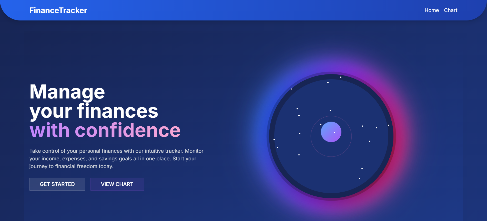

# 📊 Personal Finance Tool

## Overview

“I was often confused about my savings and their calculations. Now, here is my tool to maintain regular income management!”

The **Personal Finance Tool** is your all-in-one solution for tracking income, managing expenses, and visualizing your financial health. Built with cutting-edge technologies like **Next.js** and **React**, it combines functionality with an engaging, modern interface to simplify personal finance management.

Whether you're budgeting for the month, reviewing expenses, or celebrating financial milestones, this tool is designed to empower you with clear insights and seamless usability.

---



## ✨ Key Features

| **Feature**                  | **Description**                                                                                       |
|------------------------------|-------------------------------------------------------------------------------------------------------|
| 🔐 **Password Protection**    | Safeguard your financial data with secure login access.                                               |
| 📈 **Transaction Management** | Add, view, and categorize your income and expenses effortlessly.                                       |
| 🎨 **Interactive Charts**      | Gain insights into your financial activities over time with dynamic and responsive visualizations.      |
| 📺 **Responsive Design**       | Optimized for both desktop and mobile devices for on-the-go tracking.                                   |
| 🎮 **Animated UI**             | Enjoy smooth animations and transitions, making finance management engaging.                           |
| 🌌 **Dark Mode**              | Switch to dark mode for a comfortable experience in low-light environments.                            |
| 🎉 **Celebratory Effects**    | Celebrate milestones like reaching savings goals with confetti animations!                             |

---

## 🛠️ Technologies Used

This project leverages modern frameworks and libraries to deliver a powerful and delightful user experience:

- **Next.js 13**: Utilizes the App Router for scalable and dynamic web applications.
- **React 18**: Provides the foundation for building reusable and interactive components.
- **TypeScript**: Ensures type safety and better maintainability of the codebase.
- **Tailwind CSS**: Simplifies styling with utility-first classes and responsive designs.
- **Framer Motion**: Adds smooth and modern animations to the UI.
- **Recharts**: Implements beautiful and customizable data visualizations.
- **Canvas Confetti**: Elevates the user experience with celebratory animations.
- **Shadcn UI**: Delivers polished and reusable UI components.

---

## 🔧 Getting Started

### Prerequisites

Ensure you have the following installed on your machine:

- **Node.js** (v14 or later)
- **npm** or **yarn**

### Installation

Follow these steps to set up the project locally:

1. **Clone the Repository**:
   ```bash
   git clone https://github.com/your-username/personal-finance-tool.git
   ```

2. **Navigate to the Project Directory**:
   ```bash
   cd personal-finance-tool
   ```

3. **Install Dependencies**:
   ```bash
   npm install
   # or
   yarn install
   ```

4. **Start the Development Server**:
   ```bash
   npm run dev
   # or
   yarn dev
   ```

5. Open your browser and visit:
   ```
   http://localhost:3000
   ```

---

## 🔄 Workflow

### Adding Transactions
1. Log in with your secure credentials.
2. Add income or expense transactions using the intuitive form.
3. Categorize and track your financial activities instantly.

### Visualizing Finances
- View dynamic charts to understand your spending patterns.
- Use filters to customize data visualizations by date or category.

### Milestone Celebrations
- Achieve your savings goals and watch celebratory confetti animations bring a touch of joy to your accomplishments!

---

## 📚 Roadmap

- **Upcoming Features**:
  - Budgeting tools for setting monthly limits.
  - AI-based financial advice and insights.
  - Multi-language support for global users.

- **Enhancements**:
  - More chart types for deeper financial analysis.
  - Offline access to financial records.

---

## 📧 Feedback & Contributions

We welcome feedback and contributions to improve the Personal Finance Tool. Feel free to:

- Report issues: [GitHub Issues](https://github.com/your-username/personal-finance-tool/issues)
- Contribute: Fork the repo, make changes, and submit a pull request.

---

## 🚀 Demo

Check out the live demo:
[Personal Finance Tool Demo](https://your-demo-url.com)

---

## 👤 Author

Developed with ❤️ by [Your Name](https://your-profile-link.com). For inquiries, connect via [LinkedIn](https://linkedin.com/in/your-profile).

---

## 🛡️ License

This project is licensed under the MIT License. See the [LICENSE](LICENSE) file for details.

